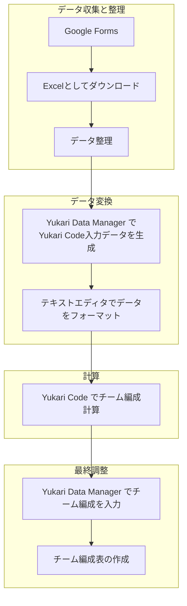

# クイックスタートガイド

このガイドは、Yukari Code 2 をインストールし、使用するための簡単な手順を説明します。

## 作業ディレクトリを設定する

チーム最適化のためのディレクトリ（フォルダ）を任意の場所に作成してください。このガイドでは、デスクトップ上に「Yukari」という作業ディレクトリを作成すると仮定します。

Yukariディレクトリのパスは以下のようになります：

- macOS: `/Users/(ユーザー名)/Desktop/Yukari`
- Windows: `C:/Users/(ユーザー名)/Desktop/Yukari`

## コード、サンプル、ドキュメントをダウンロードする

[Yukari_Code_2 リポジトリ](https://github.com/tohru-murakami/Yukari_Code_2) からすべてのファイルをダウンロードし、解凍してください。

## 実行ファイルとサンプルデータをコピーする

実行ファイル `grouping_ils`（macOS用）または `grouping_ils.exe`（Windows用）を Yukari ディレクトリの最上層にコピーしてください。

また、サンプルデータファイル `data16.txt` も Yukari ディレクトリにコピーしてください。

## テストを実行する

ターミナルアプリケーションを開きます：

- macOS: Terminal.app
- Windows: コマンドプロンプト

Yukariディレクトリに移動します：

```
% cd (Yukariディレクトリのパス)
```

Yukari Codeを実行します。

macOSの場合：

```
% ./grouping_ils data16.txt
```

Windowsの場合：

```
> grouping_ils.exe data16.txt
```

約5分後、以下のような結果が表示されます：

```
% ./grouping_ils data16.txt
data16.txt
0,4,0g,5gH,10,13,6 6 7 4 7 9 ,37.0,39,2,2,1,
1,4,6H,8,11,15,4 6 9 6 4 9 ,34.0,38,0,4,1,
2,4,1g,4g,7H,9,6 6 9 5 10 9 ,45.0,45,2,2,1,
3,4,2g,3g,12,14,8 6 5 10 6 9 ,44.0,44,2,2,0,
Total Value = 160.0
Minimum Compatibility = 4
Total Compatibility = 166
```

## Yukari Codeを実際のチーム編成に使用する

Yukari Code を使用して実際のチームを最適化するためには、適切なデータを準備する必要があります。

### フロー概要



### Googleフォームアンケートの作成

学生からのデータを収集するために、Googleフォームを作成し、1～5のリッカート尺度で回答できるようにします。

詳細については、サンプル調査を参照してください：

```
/GitHub/Yukari_code_2/Yukari Data Manager/Yukari_Preference_Survey.md
```

### データのダウンロードと整理

アンケートが完了したら、データをExcel形式でダウンロードし、整理してください。

回答を拒否した学生については、空白のデータを作成してください。

### Yukari Code 用の入力データを生成

整理したデータをYukari Data Managerにコピー＆ペーストし、Yukari Code用の入力データを生成します。

詳細はREADME_YMDを参照してください：

```
/GitHub/Yukari_code_2/Yukari Data Manager/READEME_YMD.md
```

### Yukari Code の実行

ターミナルを使用して、Yukari Code を実行します。

詳細はREADMEを参照してください：

```
/GitHub/Yukari_code_2/READEME.md
```

### チーム編成表の作成

最適化されたチーム編成データをYukari Code Manager に入力し、チーム編成表を作成します。

詳細はREADME_YMDを参照してください：

```
/GitHub/Yukari_code_2/Yukari Data Manager/READEME_YMD.md
```

## オプション：ソースコードのコンパイル（macOS & Linux）

macOSおよびLinuxユーザーは、`make` を使用してソースコードをコンパイルできます。以下の手順に従ってください。

### ビルドツールをインストールする

必要なビルドツール（`gcc` や `clang` などのC/C++コンパイラと `make`）がインストールされていることを確認してください。

#### macOS

Xcodeのコマンドラインツールをインストールします：

```
% xcode-select --install
```

#### Linux

`gcc` と `make` をインストールします：

```
% sudo apt update
% sudo apt install build-essential
```

### ソースコードディレクトリに移動する

ソースコードファイルがあるディレクトリに移動します。例えば、`Yukari` ディレクトリにソースコードがある場合、以下のように移動します：

```
% cd (Yukariディレクトリ)/Source_code
```

### `make` コマンドを実行する

ターミナルで `make` コマンドを実行してソースコードをコンパイルします。

```
% make
```

正しく設定されていれば、同じディレクトリ内に `grouping_ils` という実行ファイルが生成されます。

### コンパイルの確認

`make` の処理が終了したら、ディレクトリ内のファイル一覧を表示して、`grouping_ils` が作成されたことを確認してください。

```
% ls -l
```

ファイル一覧に `grouping_ils` 実行ファイルがあるはずです。

```
total 680
-rw-r--r--@ 1 user  staff     230 12  3 23:27 Makefile
-rwxr-xr-x  1 user  staff  134236  1 24 11:04 grouping_ils
-rw-r--r--@ 1 user  staff   33415 12  3 23:27 grouping_ils.cpp
-rw-r--r--@ 1 user  staff    3972 12  3 23:27 grouping_ils.hpp
-rw-r--r--  1 user  staff  165868  1 24 11:04 grouping_ils.o
```
